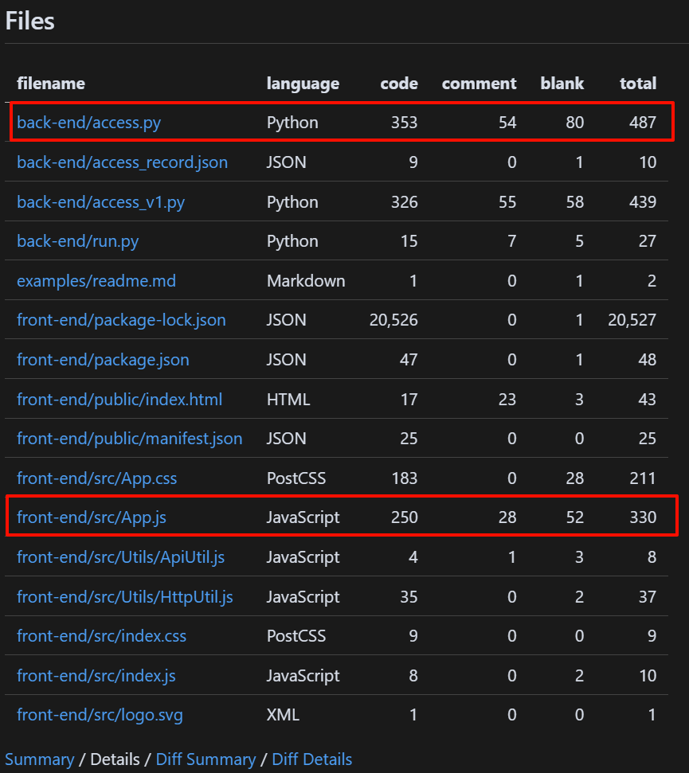
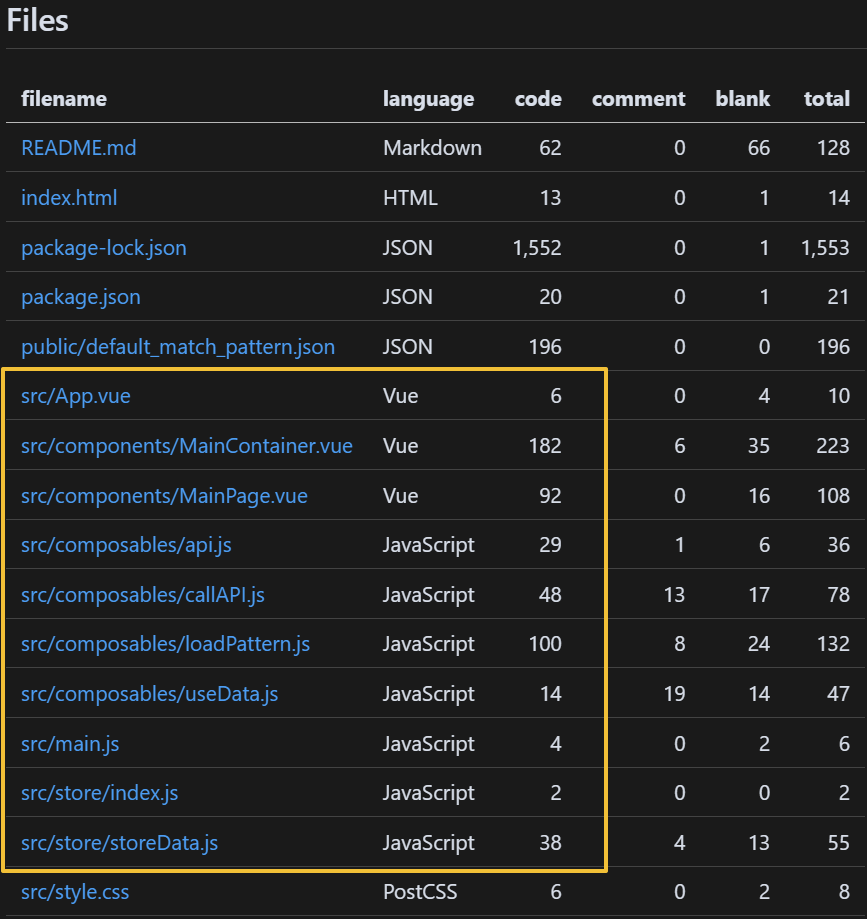
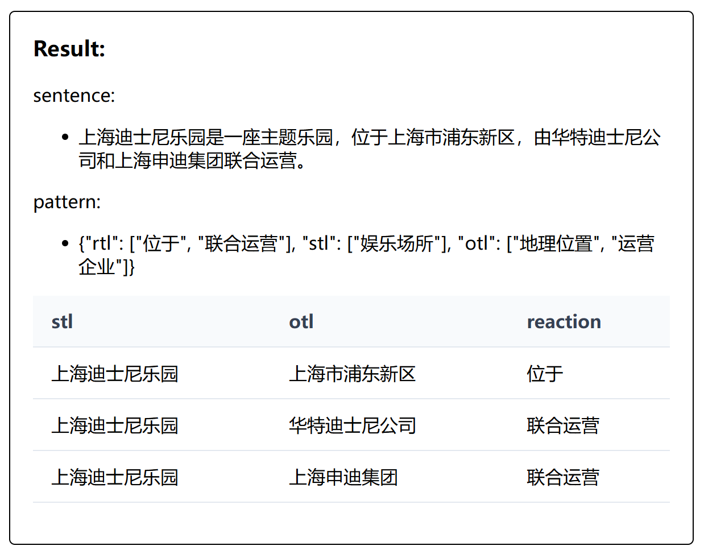
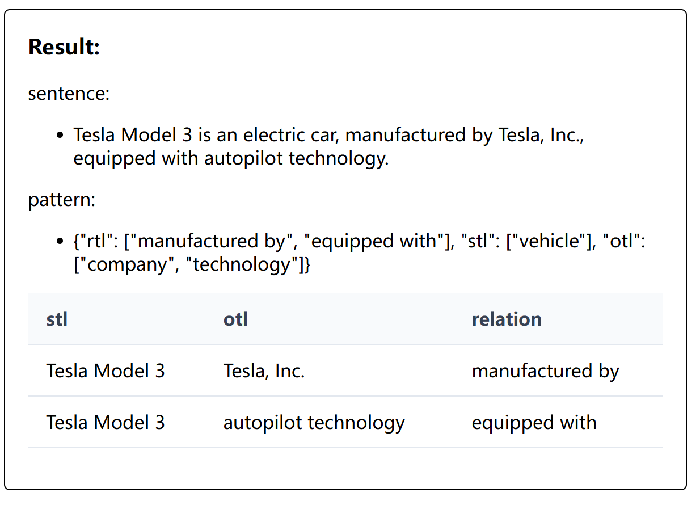
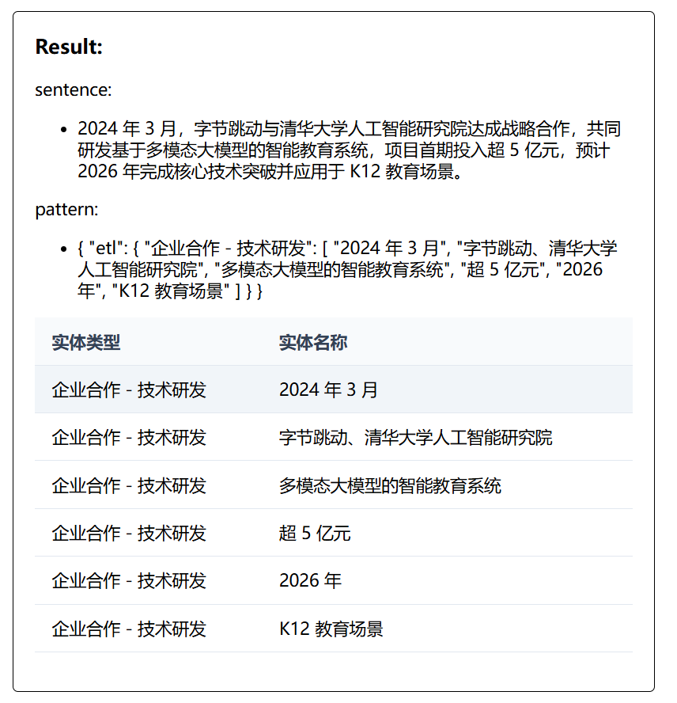
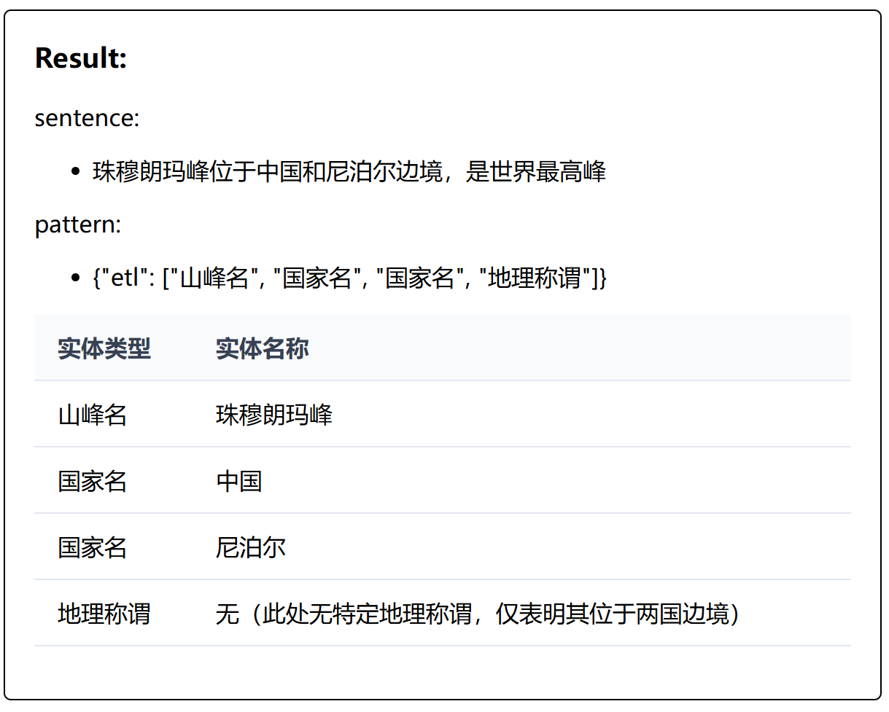
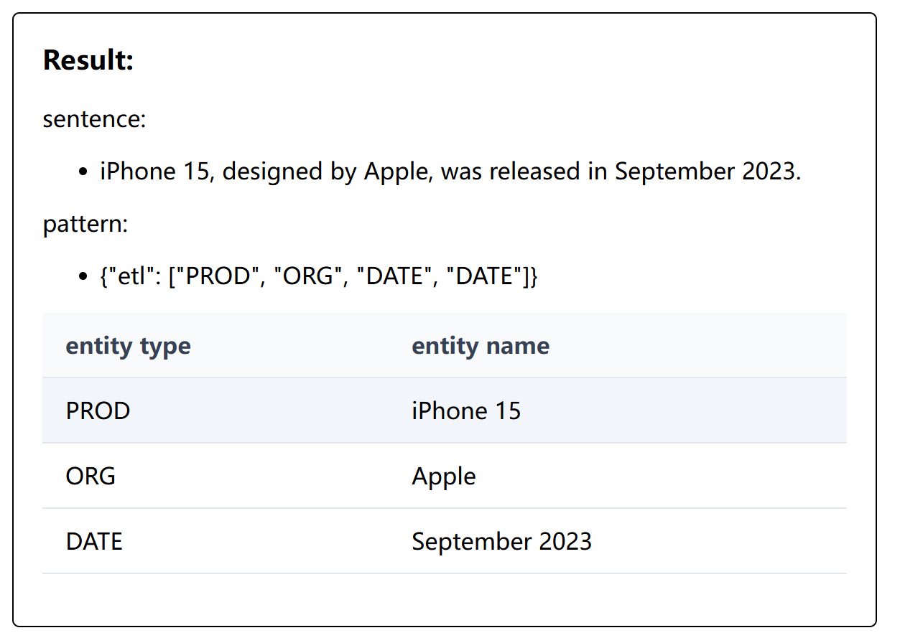

# ChatIE

**NOTE: It's a rebuilt version of [ChatIE](https://github.com/cocacola-lab/ChatIE) project from [CoLa Lab](https://github.com/cocacola-lab) BJTU**

[GPT4IE](https://github.com/lavanceeee/GPT4IE) is a clean version of ChatIE, which integrates two-stage framework into a unified system and using only one set of prompt. The result is equally execellent!

## What I have done

- [x] Essential Code Refactoring & Optimization

- [X] Benchmarking based on different LLMs

- [ ] Benchmarking based on large data set

- [ ] Richer Core functions(resust visualization, saving, tec...) 

|Aspect|Orginal|Rebuilt |
| :-------|:-------|:-------|
|Framework| Flask+JS| Pure JS |
|Complexity| High (Bloated logic)|Low (Decoupled)|
|Code Structure| Monolithic with mixed logic | Layered (data, processing, UI)|
|API Integration|Backend driven|Frontend direct calls|
|Code Size| ~1100LOC| ~700LOC|
|Scalaboloty|server dependent|client side|

### Project structure comparison

#### Orginal

The original project centralized core logic in `access.py` (backend processing, ~353 LOC) and `App.js` (frontend logic and UI, ~400 LOC). This high coupling between logic and view layers led to poor modularity, making it difficult to extend functionality or maintain code. When reviewing the source code, the tightly coupled structure obscured the overall design, complicating comprehension and modification.

#### Rebuilt

I refactored the project into pure JavaScript, eliminating Flask and consolidating all logic (e.g., data parsing, LLM prompt handling) into the frontend for a cleaner architecture.

I systematically restructured the processing logic, addressing overly complex designs and redundant variables (e.g., ~1% of variables were redundant). By applying layered processing and logical decoupling, I reduced complexity and enhanced code clarity.

Through engineering refactoring, I adopted Vue to separate view and logic layers, consolidating all processing logic (e.g., data parsing and LLM prompt handling) into the frontend using JavaScript. This significantly reduced code redundancy and overly complex designs. For instance, `App.js` was streamlined from ~250 LOC to mostly ~70 LOC. The refactored codebase features a clear logical hierarchy, improved scalability, and enhanced readability.

## What I have learned 

Zero-shot Information Extraction attempts to extract structured information using LLMs also prompt engineering. By leveraging modern LLM APIs, such as ChatGPT, DeepSeek, structured information extraction has been successfully achieved through prompt-driven, multi-turn conversations.

Test results vary across different LLM models also different processing model between ChatIE and GPT4IE: I used `doubao-lite-32k-240828` and `deepseek-r1-250528`for testing, the results indicate that lightweight models(e.g., `doubao-lite-32k-240828`) are better suited for integrated IE tasks(GPT4IE), while models with a higher parameter couts(e.g., `deepseek-r1-250528`) excel in complex, two-stage framework(ChatIE).

## Benchmark

**The complete test result is on the folder `/test`.** 

Results indicate that LLMs with larger parameters counts achieve better performance, with more stable and comprehensive outputs.

### RE

sentence:

+ 上海迪士尼乐园是一座主题乐园，位于上海市浦东新区，由华特迪士尼公司和上海申迪集团联合运营。

pattern: 

+ {"rtl": ["位于", "联合运营"], "stl": ["娱乐场所"], "otl": ["地理位置", "运营企业"]}

result:

sentence:

+ Tesla Model 3 is an electric car, manufactured by Tesla, Inc., equipped with autopilot technology.

pattern:

+ {"rtl": ["manufactured by", "equipped with"], "stl": ["vehicle"], "otl": ["company", "technology"]}

### EE

sentence:
+ 2024 年 3 月，字节跳动与清华大学人工智能研究院达成战略合作，共同研发基于多模态大模型的智能教育系统，项目首期投入超 5 亿元，预计 2026 年完成核心技术突破并应用于 K12 教育场景。

pattern: 
+  {
"etl": {
"企业合作 - 技术研发": [
"2024 年 3 月",
"字节跳动、清华大学人工智能研究院",
"多模态大模型的智能教育系统",
"超 5 亿元",
"2026 年",
"K12 教育场景"
]
}
}

result:

### NER

sentence:

+ 珠穆朗玛峰位于中国和尼泊尔边境，是世界最高峰。

pattern：

+ {"etl": ["山峰名", "国家名", "国家名", "地理称谓"]}

result：

sentence:
+ iPhone 15, designed by Apple, was released in September 2023.

pattern:

+ {"etl": ["PROD", "ORG", "DATE", "DATE"]}

